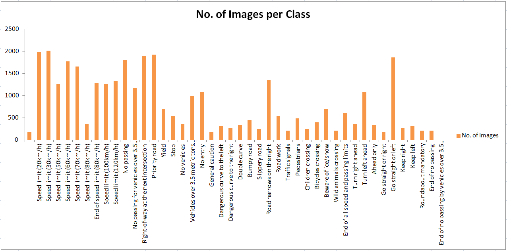

## Project: Traffic Sign Recognition with Convolutional Neural Networks

Overview
---

In this project, a convolutional neural network (CNN) is used to classify traffic signs. The traffic sign dataset used is the
 [German Traffic Sign Dataset](http://benchmark.ini.rub.de/?section=gtsrb&subsection=dataset). The trained network is tested on new images of the German traffic signs from the web.

The implementation can be found in the [Ipython notebook](https://github.com/umarkhan048/Udacity-Traffic-Sign-Classifier/blob/master/Traffic_Sign_Classifier.ipynb) in this repository.

The Project
---
The goals / steps of this project are the following:

* Load the data set
* Explore, summarize and visualize the data set
* Design, train and test a model architecture
* Use the model to make predictions on new images
* Analyze the softmax probabilities of the new images
* Summarize the results with a written report

#### 1. Summary of Dataset

I used the pandas library to calculate summary statistics of the traffic signs data set:

* The size of training set is 34799 images
* The size of the validation set is 4410 images
* The size of test set is 12630 images
* The shape of a traffic sign image is (32, 32, 3)
* The number of unique classes/labels in the data set is 43

#### 2. Exploratory Visualisation of the Dataset

The number of images per class in the dataset is as following:

