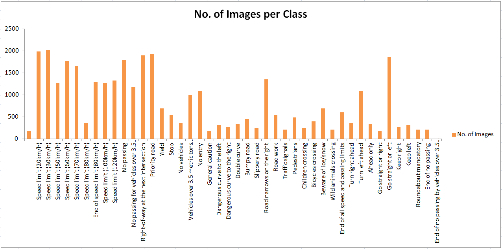
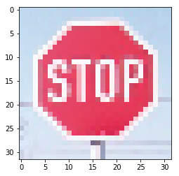
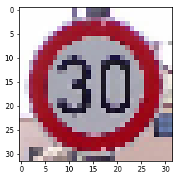
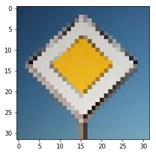
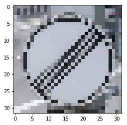
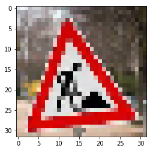

## Project: Traffic Sign Recognition with Convolutional Neural Networks

Overview
---

In this project, a convolutional neural network (CNN) is used to classify traffic signs. The traffic sign dataset used is the
 [German Traffic Sign Dataset](http://benchmark.ini.rub.de/?section=gtsrb&subsection=dataset). The trained network is tested on new images of the German traffic signs from the web.

The implementation can be found in the [Ipython notebook](https://github.com/umarkhan048/Udacity-Traffic-Sign-Classifier/blob/master/Traffic_Sign_Classifier.ipynb) in this repository.

The Project
---
The goals / steps of this project are the following:

* Load the data set
* Explore, summarize and visualize the data set
* Design, train and test a model architecture
* Use the model to make predictions on new images
* Analyze the softmax probabilities of the new images
* Summarize the results with a written report

#### 1. Summary of Dataset

I used the pandas library to calculate summary statistics of the traffic signs data set:

* The size of training set is 34799 images
* The size of the validation set is 4410 images
* The size of test set is 12630 images
* The shape of a traffic sign image is (32, 32, 3)
* The number of unique classes/labels in the data set is 43

#### 2. Exploratory Visualisation of the Dataset

The number of images per class in the dataset is as following:

#### 3. Design, Training and Testing of the Model Architecture

For this project, the LeNet architecture is used. The LeNet architecture, as published in the original paper is shown below:

The original paper can be found [here](http://yann.lecun.com/exdb/publis/pdf/lecun-01a.pdf)

The LeNet architecture takes the input as images of 32 x 32 pixels. The input can be a 3 channel RGB image or 
it can be a grayscale image. Running the model with grayscale did not yield any improvement in the performance of the network 
therefore I decided to keep the images in the RGB form.

An overview of my LeNet architecture is presented below:

| Layer         	   	        |     Description	        					  | 
|:----------------------------:|:----------------------------------------------:| 
| Input Convolutional Layer    |Input = 32x32x3, Output = 28x28x6               |
| Activation Layer             |ReLU                                            |
| Max Pooling Layer            |Input = 28x28x6, Output = 14x14x6               |
| Convolutional Layer          |Input = 14x14x6, Output = 10x10x16              |
| Activation Layer             |ReLU                                            |
| Max Pooling Layer            |Input = 10x10x16, Output = 5x5x16               |
| Flattening Layer             |Input = 5x5x16, Output = 400                    |
| Fully Connected Layer        |Input = 400, Output = 120                       |
| Activation Layer             |ReLU                                            |
| Fully Connected Layer        |Input = 120, Output = 84                        |
| Activation Layer             |ReLU                                            |
| Output Layer                 |Input = 84, Output = 43                         |

To introduce non-linearity in the model, the Rectified Linear Unit (ReLU) Activation layer is used.
For the pooling layer, average pooling was tested. With average pooling, the validation accuracy reduced from
91% to 89%, therefore, max pooling is kept. A stride of 1x1 is used and the padding is kept to valid.

To optimize the model, the learning rate is reduced from 0.001 to 0.0005. Experimenting with epochs and batch size showed that 
the epoch size of 80 and the batch size of 64 images works the best. The validation accuracy reached to 93% after taking these measures.

For further optimization, dropouts were  introduced. The validation accuracy increased to 95%. Further improvement is achieved by
introducing L2 Regulation. With this, the validation accuracy of 96.5% is reached.

The summary of the results of the final model are as follows:

* validation set accuracy of 96.5%
* test set accuracy of 95.1%

#### Prediction on New Images

The following five images are used to test the predictions of the trained CNN. These images are preprocessed as required by the model.

| Image         	   	                     |     Label / Description	                      |
|:-----------------------------------------:|:---------------------------------------------:|
|   |   14 / Stop                                   |
|   |   1  / Speed Limit (30 km/h)                  |
|   |   12 / Priority Road                          |
|   |   32 / End of all speed and passing limits    |
|   |   25 / Road work                              |

The model performed very well on the 5 new images and predicted all the images correctly. This corresponds to an accuracy of 100%. 
This may be due to the fact that 3 out of 5 image classes have a very high number of training images available (>1500). Additionally, for
all 5 images, the shapes are very different (triangle, hexagon, diamond and round). The accuracy may reduce if relatively similar images are
used e.g speed limit 20 km/h, speed limit 30 km/h and speed limit 50 km/h.

The top five softmax probability values for the new images is coming out to be 1 whereas the probability values for the second, third, fourth and
fifth positions are extremely low.